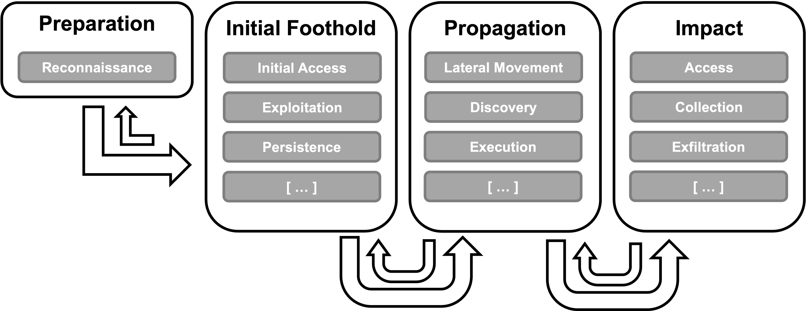
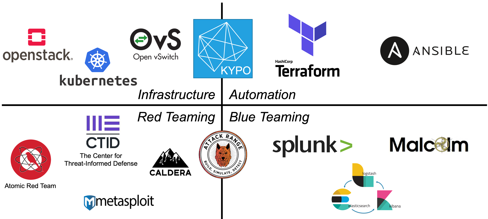
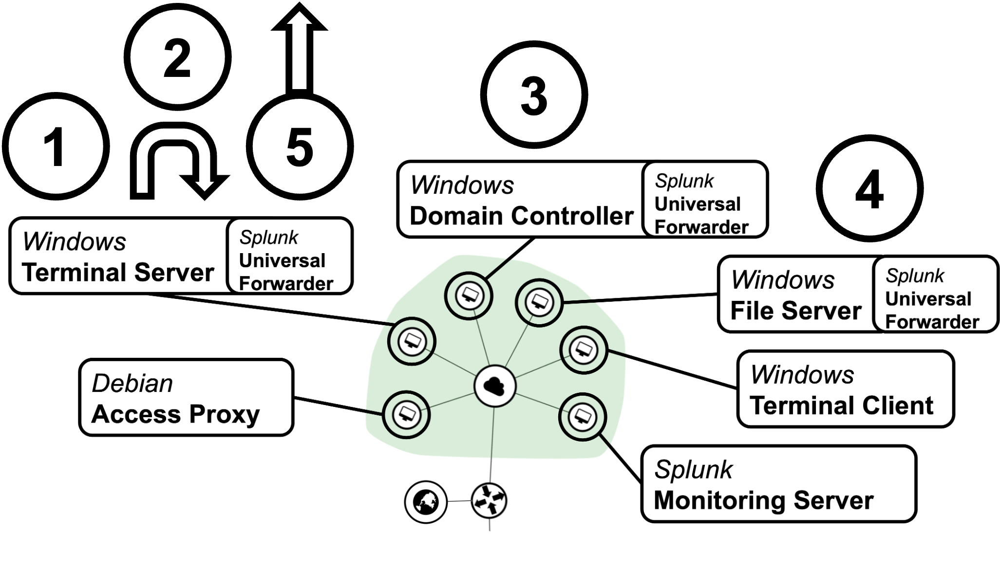
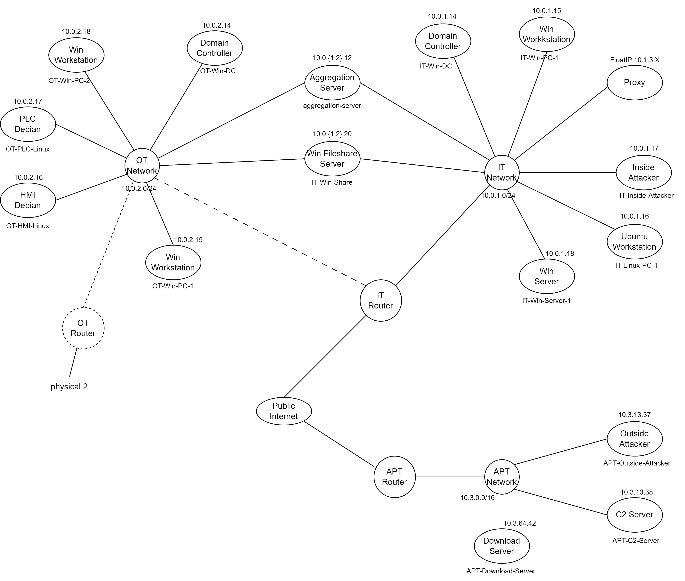
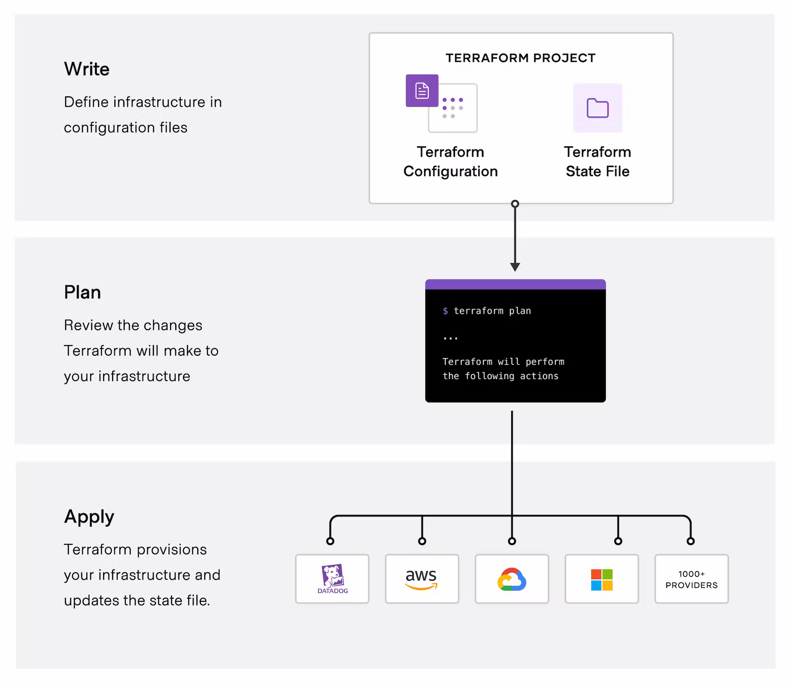
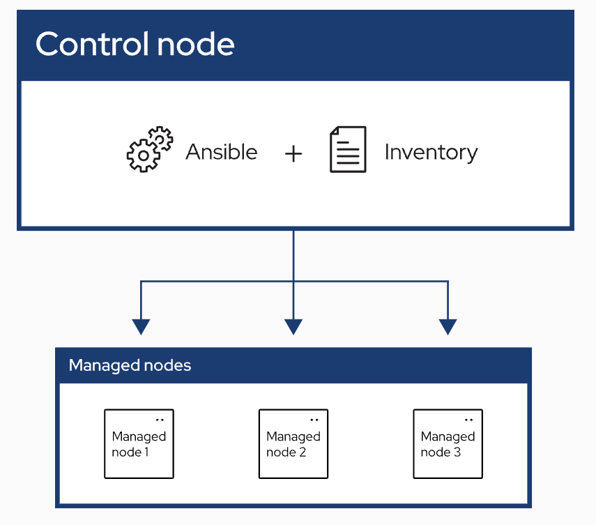
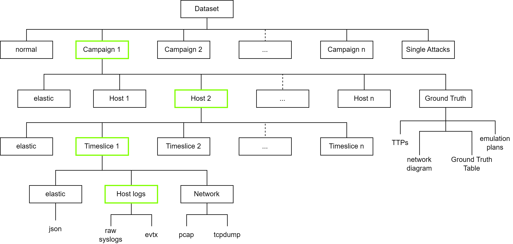

# AROS
The Attack Range OpenStack (AROS) is a collaborative project by the Institute for Automation and Applied Informatics (IAI) at the Karlsruher Institute for Technology (KIT).
The goal of the project is to create a virtual testing environment for cyber security attacks.

<div>
  
</div>

To achieve this goal the AROS is constructed using preexisting cyber ranges (namely KYPO and the Splunk Attack Range) as inspiration, whilst integrating additional tools.

<div>
  
</div>

The result is a cyber ranges capable of constructing divers scenarios in a reproducible manner.

<div>
  
</div>

This basic scenario describes the following steps:
1. Reconnaissance: The attacker gathers information about the target network or system to identify vulnerabilities and potential points of entry.
2. Initial Access: The attacker gains a foothold in the target system, often through phishing, exploiting vulnerabilities, or other attack vectors.
3. Discovery: The attacker explores the compromised environment to map out the network, systems, and sensitive data that can be targeted.
4. Access: The attacker escalates privileges and moves laterally within the network to gain control over more critical systems or data.
5. Exfiltration: The attacker transfers valuable or sensitive information from the compromised network to their own external location without detection.

<div>
  
</div>

The current research for this project aims to construct the scenario shown in the previous image.
Corresponding to that, a cyber kill chain suited to the scenario is established.
The goal is to automatically construct the scenario and perform the cyber kill chain with minimal manual input.

## Abstract of the corresponding initial master thesis
This thesis presents the development and evaluation of a self-hosted cyber range environment tailored for attack emulation and detection in large-scale critical infrastructure networks. Leveraging Infrastructure as Code (IaC) tools and cloud platforms, the research addresses challenges in accessing cloud services and the scarcity of cyber ranges for critical infrastructure research.
Key findings include the successful construction of the cyber range named Attack Range Open Stack (AROS) capable of handling complex environments and providing full de- tectability of network tra￿c and actions on virtual machines. The research highlights challenges in setup-time optimization, scalability testing, and integration of real energy hardware for enhanced testing capabilities.
The contributions of this work lie in the development of a sophisticated cyber range envi- ronment and the achievement of full detectability, offering researchers a valuable platform for conducting reproducible cyber security experiments. Future research directions include enhancing scenario complexity and exploring AI-driven data analysis.
Overall, this thesis contributes to advancing cyber security research by providing in- novative tools and methodologies for evaluating cyber threats in critical infrastructure networks.

## Support
If support is needed, please contact the uueaj@student.kit.edu E-Mail.

Creating a public network after neutron purge
To make the cyber range fully usable a public network is needed.
This can be created through the OpenStack UI or by using a corresponding terraform configuration.
It is important to note that a public-subnet is also required for the full usability of the public network.

## Terraform
<div>
  
</div>

## Ansible
<div>
  
</div>

## Deployment
The usage of the AROS requires a running OpenStack instance.

```
scp -r . cyberrange-copy:/home/iai/attack_range_openstack
ssh cyberrange-copy
cd attack_range_openstack
cd 1_resource_generation
terraform apply
```

Ideally the Ansible playbooks are already executable from within the terraform stage. If this is not the case, cd into 2_ansible_resource_provisioning/ and execute the selected playbooks from there.


<!--## Working with the Infrastructure

<div>
  
</div>


## Data collection

elk beats
raw log data
wireshark

## Dataset

<div>
  
</div>-->


## Troubleshooting

### Flavor ID not known

Terraform has not created the custom flavors yet and so does not know them. A possible solution is to change back to flavor_name, use m1.medium or so, execute terraform apply and change back to the custom terraform ids.

### terraform destroy does not clean up everything

if terraform destroy does not clean up everything

delete all instances in openstack
delete all routers
delete all remaining floating IPs
delete ports in all networks
delete all networks but not public


### Terraform encounters countless of errors out of the blue

Your terraform state/save file might be corrupted. Rename it and re-run.
The cause for this is a mismatch between terraform operations and tasks done in Openstack. If actions in Openstack lead to a (minor/significant?) difference, the system state is no longer accurately depicted by the tfstate file and therefore terraform is confused. Never do this. For example never touch the plubic network

```
cd /home/iai/attack_range_openstack/1_resource_generation
mv terraform.tfstate terraform.tfstate.old
mv terraform.tfstate.backup terraform.tfstate.backup.old
```


### I accidentally deleted network public

Much desaster, now you have to re-install Openstack. Save your OS images and metadata and re-run the install script.

```
#!/bin/bash

image_path=/home/iai/attack_range_openstack/0_image_generation/
cd "$image_path"
mkdir save
cd save

if [ -f Metadata.txt ]
then
  echo "" > Metadata.txt
else 
  touch Metadata.txt
fi

IFS=$'\n'
images=( $(glance image-list | head -n -1 | tail -n +4 | sed 's/|//g' | awk '{$1=$1};1') )

for image in "${images[@]}"
do
  id=$(echo $image | cut -c1-36)
  name=$(echo $image | cut -d " " -f 2- | sed 's/ /_/g')
  glance image-download --file ./$name.img $id
  glance image-show $id >> Metadata.txt
  echo "" >> Metadata.txt
done

unset IFS


sudo -i
source kolla-ansible-venv/bin/activate
kolla-ansible -i all-in-one destroy
kolla-ansible -i all-in-one deploy
kolla-ansible -i all-in-one post-deploy


cd "$image_path/save/"

for file in *.img 
do
  glance image-create --name ${file%.*} --disk-format qcow2 --container-format bare --file $file --visibility private --progress
done

openstack network create --share --external --provider-physical-network physnet1 --provider-network-type flat public

/etc/kolla/neutron-server/ml2_conf.ini ->
[ml2_type_flat]
flat_networks = physnet1

#[ovs]
#bridge_mappings = public:eth1

openstack subnet create --network public --subnet-range 10.0.0.0/24 --allocation-pool start=10.0.0.2,end=10.0.0.254 --dns-nameserver 127.0.0.53 --gateway 10.0.0.1 public

kolla-ansible -i all-in-one genconfig
kolla-ansible -i all-in-one reconfigure


import ssh key


```

```
#glance image-download --file ./28e7b185-4428-4c00-b82c-51aa1809e8f7 bionic-server-cloudimg-20230607-amd64
#glance image-download --file ./cirros 24f96693-f499-4ef0-9ea3-ef5254c3fd5f 
#glance image-download --file ./Debian_11-generic_amd64_20240211-1654 49dc9a1b-6189-4126-9e24-86cb9120e625 
#glance image-download --file ./Debian_12_generic_amd64_20240211-1654 63688ae7-c167-41e5-80db-164ef5714eef 
#glance image-download --file ./debian-10-man 73bb8e02-b572-43e1-8815-502069f6a551 
#glance image-download --file ./debian-10-openstack-arm64-splunk-base e4c61468-4c60-484d-bbb9-7ac42a1440bf 
#glance image-download --file ./debian-11-man 1ce71d8f-298c-41d5-b304-bc794ccd6894 
#glance image-download --file ./debian-9-x86_64 b5c710e2-678a-4731-a1bb-10f6632cea88 
#glance image-download --file ./kali bf8afd2a-f61b-4e2d-a747-caf2803c8d37
#glance image-download --file ./ubuntu-focal-x86_64 d508e903-4f41-491e-bf41-b0cbc0f1712a 
#glance image-download --file ./Windows_Server_2019_Eval_x86_64 b34c1867-728f-4d7b-839c-06c05a108088  
#glance image-download --file ./Windows_Server_2022_Eval_x86_64 3e8237b6-6910-4e81-aa08-787c5b4d149d  
#glance image-download --file ./Windows_Server_2022_Eval_x86_64_Debug 1da3950e-149c-4656-83ed-5fb89cf306fa  
#glance image-download --file ./windows_server_2012_domain_server d03af688-84ac-4ed5-8b05-efe12358f941  
#glance image-download --file ./windows_server_2012_kvm_exchange_server_basis 10c7f82f-8440-4714-89c1-4f8f02da8ab5  

#glance image-show 28e7b185-4428-4c00-b82c-51aa1809e8f7 >> Metadata.txt
#echo "" >> Metadata.txt
#glance image-show 24f96693-f499-4ef0-9ea3-ef5254c3fd5f >> Metadata.txt
#echo "" >> Metadata.txt
#glance image-show 49dc9a1b-6189-4126-9e24-86cb9120e625 >> Metadata.txt
#echo "" >> Metadata.txt
#glance image-show 63688ae7-c167-41e5-80db-164ef5714eef >> Metadata.txt
#echo "" >> Metadata.txt
#glance image-show 73bb8e02-b572-43e1-8815-502069f6a551 >> Metadata.txt
#echo "" >> Metadata.txt
#glance image-show e4c61468-4c60-484d-bbb9-7ac42a1440bf >> Metadata.txt
#echo "" >> Metadata.txt
#glance image-show 1ce71d8f-298c-41d5-b304-bc794ccd6894 >> Metadata.txt
#echo "" >> Metadata.txt
#glance image-show b5c710e2-678a-4731-a1bb-10f6632cea88 >> Metadata.txt
#echo "" >> Metadata.txt
#glance image-show bf8afd2a-f61b-4e2d-a747-caf2803c8d37 >> Metadata.txt
#echo "" >> Metadata.txt
#glance image-show d508e903-4f41-491e-bf41-b0cbc0f1712a >> Metadata.txt
#echo "" >> Metadata.txt
#glance image-show b34c1867-728f-4d7b-839c-06c05a108088 >> Metadata.txt
#echo "" >> Metadata.txt
#glance image-show 3e8237b6-6910-4e81-aa08-787c5b4d149d >> Metadata.txt
#echo "" >> Metadata.txt
#glance image-show 1da3950e-149c-4656-83ed-5fb89cf306fa >> Metadata.txt
#echo "" >> Metadata.txt
#glance image-show d03af688-84ac-4ed5-8b05-efe12358f941 >> Metadata.txt
#echo "" >> Metadata.txt
#glance image-show 10c7f82f-8440-4714-89c1-4f8f02da8ab5 >> Metadata.txt
#echo "" >> Metadata.txt

```


<!--### complete network wipe

If you need a complete wipe and routers do not want to be destroyed

```
openstack project show admin
```

-> id

+-------------+-----------------------------------------------+
| Field       | Value                                         |
+-------------+-----------------------------------------------+
| description | Bootstrap project for initializing the cloud. |
| domain_id   | default                                       |
| enabled     | True                                          |
| id          | 65e52ade32d74c699bef395584d2c91c              |
| is_domain   | False                                         |
| name        | admin                                         |
| options     | {}                                            |
| parent_id   | default                                       |
| tags        | []                                            |
+-------------+-----------------------------------------------+

```
neutron pruge 65e52ade32d74c699bef395584d2c91c
```

this wipes all network stuff

so now you have to re-create the public network for internet access

```
openstack network create public --external --provider-physical-network physnet1 --provider-network-type flat
neutron subnet-create public 10.0.1.0/24 --name public --allocation-pool start=10.0.1.2,end=10.3.254.254 --dns-nameserver DNS_RESOLVER --gateway 10.0.1.1
```

physnet1 is the name of of the physical network adapter in your machine 

manually create new public subnet with network address 10.0.1.0/24

after that you need to update the router id in your terraform config for every router (external network id)-->


## Roadmap

- Benign behaviour and traffic generation
- More versions of Windows Server and Desktop
- Win Server applications
- IACS device images and applications
- APT28 Campaigns
- APT29 Campaigns
- CyberAv3nger Campaigns
- Dataset Release
- Cyberrange image release


## Authors and acknowledgment
Special thanks to Dr.Ing Kaibin Bao, Qi Liu and Richard Rudolph for supporting the construction of the cyber range.

Author of AROS: Leon Huck
Project coordinator: Kaibin Bao, Richard Rudolph

## Support
If support is needed, please contact uueaj@student.kit.edu, qi9091@partner.kit.edu and kaibin.bao@kit.edu


## Project status
Development for this project is currently ongoing.

